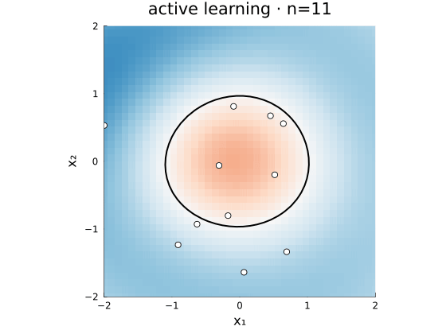

<p align="center">
  <picture>
    <source media="(prefers-color-scheme: dark)" srcset="docs/src/assets/logo-dark.svg"/>
    
  </picture>
</p>

<h1 align="center">Magpie.jl</h1>

<p align="center">
  <em>Composable Gaussian processes for active learning and dynamics —<br/>
  a GP as a differentiable, uncertainty-aware component.</em>
</p>

<p align="center"></p>

> **Status: v0.1, experimental.** The incremental-GP spine and active-learning loop are
> implemented and tested; the GP-in-SciML bridge is the next milestone. APIs may move.

## What it is

Magpie is a Julia-ecosystem-native Gaussian process package where **the bridges are the
product**. It builds *on* [AbstractGPs.jl](https://github.com/JuliaGaussianProcesses/AbstractGPs.jl)
and [KernelFunctions.jl](https://github.com/JuliaGaussianProcesses/KernelFunctions.jl)
rather than reinventing the GP core, and treats a GP as a *differentiable,
uncertainty-aware* building block that composes with the rest of Julia — autodiff
(Mooncake), SciML, and ML.

Two capabilities hang off one shared, incrementally-updated GP spine:

- **Active learning** — a composable `fit → acquire → observe → update` loop with
  **level-set / boundary acquisitions** (Straddle, BALD-for-classification) that are
  not yet available in Julia's GP / Bayesian-optimization packages.
- **GP-in-SciML** *(next milestone)* — a GP as the right-hand side of an ODE, trained
  *through the solver*, for data-efficient, uncertainty-calibrated dynamics discovery.

## Install

Not yet registered — add from GitHub:

```julia
pkg> add https://github.com/jowch/Magpie.jl
```

## Quick start

### Find a level set (active learning, regression)

Recover where an unknown function crosses a threshold, querying near the boundary instead
of space-filling:

```julia
using Magpie, KernelFunctions, LinearAlgebra

f(x) = norm(x) - 1.0                       # truth; its zero level set is the unit circle
al = ActiveLearner(
    ExactGP(with_lengthscale(SqExponentialKernel(), 0.5); noise = 1e-4),
    Straddle(h = 0.0),                     # level-set acquisition at threshold 0
)

for x in (4 .* rand(2) .- 2 for _ in 1:10) # cold start over the box
    observe!(al, x, f(x))
end
run!(al, f; budget = 40, over = Box([-2.0, -2.0], [2.0, 2.0]), refit_every = 10)

g = posterior_gp(al)
μ, σ² = predict(g, [[0.3, 0.4]])           # posterior mean & variance at a query
```

### Recover a decision boundary (active learning, classification)

```julia
using Magpie, KernelFunctions, LinearAlgebra

inside(x) = norm(x) < 1.0                   # true class: inside the unit disk
al = ActiveLearner(
    LaplaceGP(with_lengthscale(SqExponentialKernel(), 0.6)),
    BinaryBALD(),                           # information-gain acquisition
)

for x in (4 .* rand(2) .- 2 for _ in 1:10)
    observe!(al, x, inside(x))
end
run!(al, inside; budget = 40, over = Box([-2.0, -2.0], [2.0, 2.0]))

g = posterior_gp(al)
predmean(g, [0.3, 0.4]) > 0                 # predicted class (latent mean > 0 ⇒ inside)
```

For fully worked examples see
[`examples/levelset_straddle.jl`](examples/levelset_straddle.jl) (Straddle level-set
recovery) and [`examples/bald_classification.jl`](examples/bald_classification.jl)
(BinaryBALD classification boundary). These render as documentation pages once GitHub Pages
is enabled.

## How it fits together

- **`AbstractGPModel <: AbstractGPs.AbstractGP`** is the contract: implement `update`,
  `fit`, `predmean`, `predict` (on top of AbstractGPs' `mean`/`var`/`cov`) and a GP plugs
  into the active-learning loop. Subtyping AbstractGP means you also get `rand`, `logpdf`,
  and the Distributions interface for free.
- **`ExactGP`** caches `(δ, C::Cholesky, α)` and extends the factor incrementally via
  `AbstractGPs.update_chol`; **`LaplaceGP`** is a clean from-scratch Laplace for binary
  classification. Both differentiate under [Mooncake](https://github.com/chalk-lab/Mooncake.jl).
- **Acquisitions** (`Straddle`, `RandStraddle`, `BinaryBALD`) are differentiable functions
  of the posterior; **`acquire`** maximizes one over a `Box` or `Points` domain.

## Ecosystem context

Magpie builds on [AbstractGPs.jl](https://github.com/JuliaGaussianProcesses/AbstractGPs.jl) and [KernelFunctions.jl](https://github.com/JuliaGaussianProcesses/KernelFunctions.jl) — it reuses their GP core and kernel library rather than reinventing them.

For optimization-style infill (expected improvement, upper confidence bound, SRBF), [Surrogates.jl](https://github.com/SciML/Surrogates.jl) and [BayesianOptimization.jl](https://github.com/jbrea/BayesianOptimization.jl) are mature choices; they target minima. Magpie's active-learning acquisitions (Straddle, BinaryBALD) target level sets and classification boundaries instead — a different objective these packages don't aim at.

For GP-as-ODE-field work, [GPDiffEq.jl](https://github.com/Crown421/GPDiffEq.jl) is the original proof of concept and deserves the credit; Magpie's Capability B (not yet built) continues that direction on a through-solver, Mooncake-trained path.

## Design notes

The numerical and autodiff choices — Mooncake-first, dense factorizations through a single
`_chol` chokepoint, a from-scratch Mooncake-clean Laplace, calibrated bits-BALD — are
summarized for contributors in [`CLAUDE.md`](CLAUDE.md).

## Roadmap

- **Capability B — GP-in-SciML bridge**: a GP ODE field trained through the solver
  (`GaussAdjoint` + `MooncakeVJP`), single-shooting first.
- Sparse / inducing-point GPs and a decoupled (Matheron) sampler.
- Multi-class BALD; linear-constraint kernels.

See [`CHANGELOG.md`](CHANGELOG.md) for what's landed.

## License

[MIT](LICENSE).
